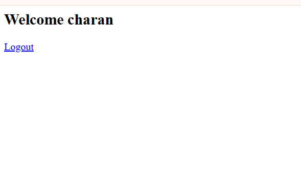

# Secure Login System

## Objective

A secure login web application developed using Flask and bcrypt for password hashing.

## Features

- User Registration
- User Login
- Password Hashing using bcrypt
- Session Management
- Logout Feature
- Protection against plain-text passwords

## Technologies Used

- Python
- Flask
- bcrypt
- JSON

## How to Run

Install required packages:

```bash
pip install flask bcrypt
```

Run the application:

```bash
py app.py
```

Open browser:

```text
http://127.0.0.1:5000
```

## Screenshot 1



## Screenshot 2

